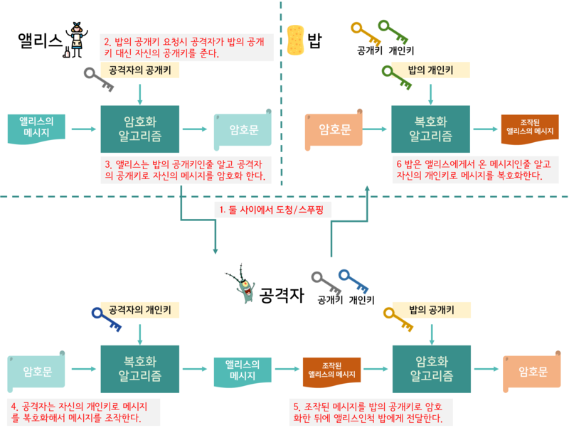

# 중간자 공격(man in the middle)

## - 대응
### * 공개키 인증 구조(PKI, Public Key Infrastructure)

공개키를 신뢰할 수 있어야 한다. 디지털 서명(Digital Signature)의 기술적인 한계이다.

`PKI`는 신뢰할 수 있는 제3자를 이용(X.509 인증서)하는 것이다.

물론 이것은 제3자를 믿을 수 있는가에 대한 문제가 생긴다.

`Alice`와 `Bob`은 합의하에 신뢰할 수 있는 제3자를 선정해야 한다.

     

# 스니핑, 스푸핑

{Pending...}