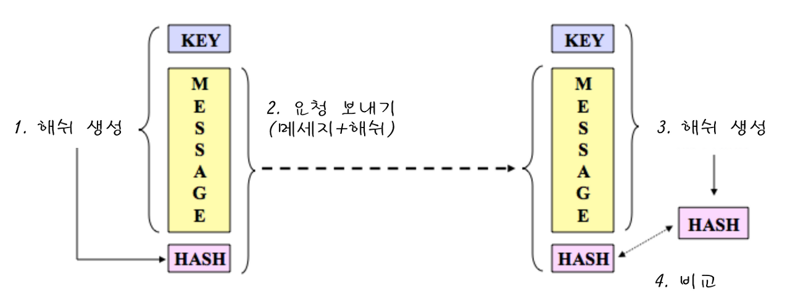

# HMAC

keyed-hash message authentication code

Message Authentication을 위한 Keyed-Hashing이라 할 수 있음.

파일 원본을 Hashing하여 Messasge Digest를 통해 원본에 대한 위변조를 확인하는 경우, 공격자가 파일 원본에 위변조를 가하여 수신자에게 악의적인 행동을 하기가 쉽지 않음.

BUT! 에초에 파일 자체가 변하지 않았다면? 미러링된 악의적인 사이트에 들어가게 되었다면?

이러한 경우 때문에 FTPS, SFTP, HTTPS와 같은 보안 파일 전송 프로토콜이 단순히 Hash()를 사용하지 않고 HMAC을 활용한다.

## 특징:

 - 공유 비밀 키(Shared Secret Key)를 사용

`송신자-수신자`가 수신하는 메세지와 MAC(Message Authentication Code)에서 + Secret key